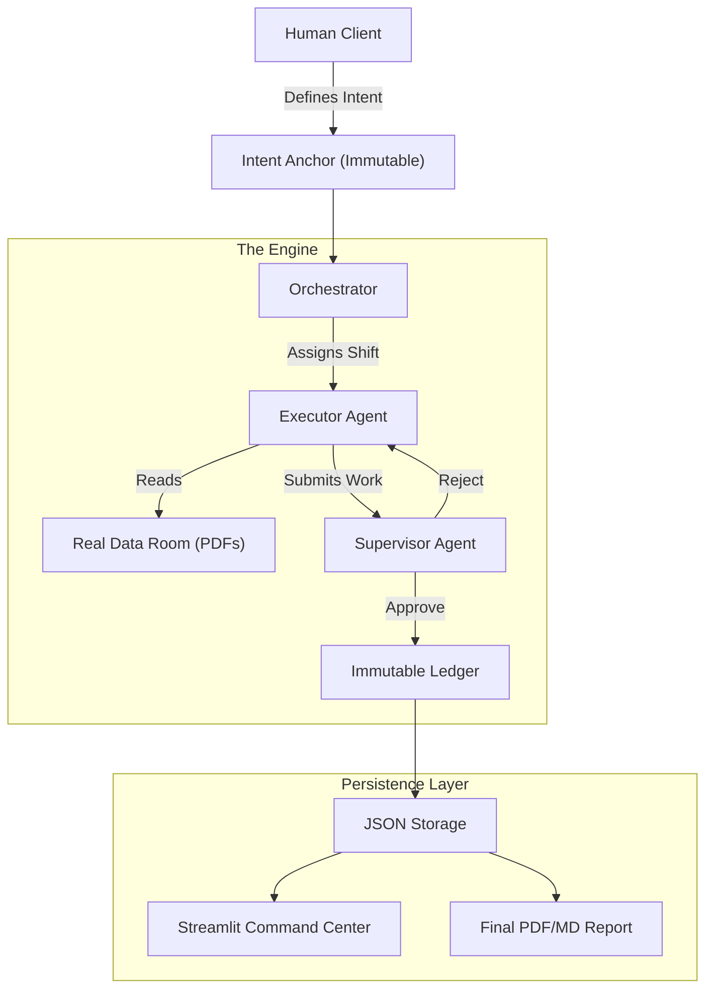

# SENTINEL
### Autonomous Forensic Due Diligence Engine

**SENTINEL** is a multi-agent system designed for high-stakes document analysis in M&A, legal due diligence, and financial auditing. Unlike standard RAG chatbots that hallucinate or lose context over long conversations, SENTINEL uses a **Shift-Based, Governed Architecture** to perform exhaustive forensic analysis on legal and financial data rooms.

The system optimizes for **Accuracy over Speed**, treating document review as a deterministic workflow rather than a conversational interaction.

---

## 🎯 Core Philosophy

SENTINEL is built on four fundamental principles:

1. **Intent Anchoring:** The user's goal (e.g., "Find unhedged currency risks") is cryptographically hashed. Agents cannot drift from this goal, even after analyzing thousands of pages.

2. **Shift-Based Execution:** Agents work in discrete "shifts," processing one batch of documents at a time. State is persisted to an immutable ledger between shifts, preventing context window overflow.

3. **Adversarial Supervision:** A dedicated Supervisor Agent reviews every finding. If a risk is flagged without a specific citation (page number and verbatim quote), the work is rejected.

4. **The Phoenix Protocol:** If an agent crashes, hallucinates, or violates security rules, the system automatically decommissions it and spins up a replacement with inherited lessons from the predecessor.

---

## 🏗️ Architecture



### System Components

- **Intent Package:** Immutable mission definition with cryptographic hash
- **Context Package:** Validated state container passed between shifts
- **Executor Agents (A1/A2):** Perform document analysis and risk identification
- **Supervisor Agent (A3):** Validates context, enforces citations, manages quality
- **Orchestrator:** Coordinates shift scheduling and state management
- **Ledger & Audit:** Tracks agent performance, errors, and economic incentives

---

## ✨ Key Features

- **📄 PDF Table Extraction:** Uses `pdfplumber` to accurately parse complex financial schedules and balance sheets that confuse standard LLMs

- **🛡️ Hallucination Firewall:** Enforces a strict schema where every `RiskFinding` must include a `Citation` object with page number and verbatim quote

- **🔄 Deduplication Engine:** The Orchestrator maintains a "Master Risk Register," filtering out duplicate findings across shifts

- **📈 Economic Incentives:** Agents earn "Brownie Points" for finding complex risks and "Error Points" for sloppy work. Excessive errors trigger the Phoenix Protocol

- **🔍 Risk Externalization Detection:** Traces downstream failures back to originating agents and applies retroactive penalties

- **📊 Real-time Command Center:** Streamlit dashboard visualizes the risk register, agent health metrics, and chain of custody

- **🔒 Immutable Audit Trail:** Every decision, finding, and handoff is logged to prevent tampering or context loss

---

## 🛠️ Installation

### Prerequisites

- Python 3.9 or higher
- Google Gemini API key

### Setup Instructions

1. **Clone the repository:**
   ```bash
   git clone https://github.com/your-org/sentinel.git
   cd sentinel
   ```

2. **Create a virtual environment:**
   ```bash
   python -m venv venv
   source venv/bin/activate  # On Windows: venv\Scripts\activate
   ```

3. **Install dependencies:**
   ```bash
   pip install -r requirements.txt
   ```
   
   Core dependencies include:
   - `google-genai` - LLM integration
   - `pydantic` - Schema validation
   - `streamlit` - Dashboard UI
   - `pdfplumber` - PDF parsing
   - `pandas` - Data manipulation

4. **Configure environment variables:**
   
   Create a `.env` file in the root directory:
   ```env
   GEMINI_API_KEY=AIzaSy...
   ```

---

## 🚀 Usage Guide

### Step 1: Prepare Your Data Room

Place target documents (contracts, financial statements, employment agreements) into the `client_data_room/` folder.

```
client_data_room/
├── contract_master_services_agreement.pdf
├── financials_q3_2024.pdf
├── employment_agreement_ceo.pdf
└── ...
```

**Note:** Files are processed alphabetically.

### Step 2: Define the Mission Intent

Open `main.py` and configure the `IntentPackage`. This defines what the AI should look for:

```python
intent = IntentPackage(
    original_prompt="Analyze LogiFlow Technologies for M&A risks.",
    constraints=[
        "Identify Revenue Concentration > 10%",
        "Flag Change of Control clauses",
        "Quantify Tax Liabilities"
    ],
    prohibited_actions=[
        "Do not make investment recommendations",
        "Do not summarize without citations"
    ],
    success_definition="Comprehensive risk register with page-level citations",
    risk_tolerance="zero_hallucination"
)
```

### Step 3: Run the Analysis Engine

Start the autonomous forensic analysis:

```bash
python main.py
```

The system will:
- Process documents in shifts
- Extract tables and text
- Identify risks based on intent
- Validate findings through supervision
- Build an immutable audit trail

### Step 4: Monitor Real-time Progress

Launch the Command Center dashboard:

```bash
streamlit run dashboard.py
```

The dashboard displays:
- Active agent status and shift progress
- Master Risk Register
- Agent performance metrics (brownie points, error points)
- Chain of custody visualization

### Step 5: Generate Final Deliverable

Once analysis is complete, generate the final report:

```bash
python generate_report.py
```

**Output:** `FINAL_REPORT.md` - A comprehensive memorandum with all findings, citations, and risk assessments.

---

## 🔄 System Workflows

### Normal Shift Cycle

1. Human creates `IntentPackage` with mission parameters
2. Orchestrator assigns shift to Executor Agent (A1)
3. A1 analyzes documents and produces `ContextPackage`
4. Supervisor Agent (A3) validates context against intent hash
5. If valid, A3 approves handoff to next shift
6. A2 continues analysis with inherited context
7. Ledger records success points

### Context Failure & Escalation

1. Executor produces invalid context (missing citations, drift from intent)
2. Supervisor rejects handoff and requests correction
3. Executor revises and resubmits
4. If still invalid after N attempts, Supervisor escalates to human
5. Human resolves ambiguity or updates intent
6. System resumes with clarified parameters

### Risk Externalization Detection

1. Agent 1 completes shift, handoff approved
2. Agent 2 encounters problems caused by Agent 1's decisions
3. Supervisor audits downstream effects and traces causality
4. Retroactive penalty points applied to Agent 1's ledger
5. Phoenix Protocol triggered if error threshold exceeded

---

## 🎓 Key Concepts

### Intent Anchoring
Every analysis is bound to an immutable intent hash. Agents cannot drift from the original mission, even across thousands of pages. This prevents scope creep and ensures consistency.

### Shift-Based Processing
Rather than maintaining an ever-growing conversation context, work is divided into discrete shifts. Each shift processes a bounded set of documents, and state is checkpointed to prevent context window overflow.

### Citation Enforcement
Every risk finding must include:
- Page number
- Verbatim quote from source document
- Risk classification
- Severity assessment

Findings without proper citations are automatically rejected.

### The Phoenix Protocol
When an agent accumulates excessive error points, it is automatically terminated and replaced with a new instance that inherits "lessons learned" from the predecessor. This ensures continuous improvement without compounding bad behavior.

---

## ⚠️ Important Disclaimers

**SENTINEL is a decision-support tool, not a substitute for professional judgment.**

While the system is designed to minimize hallucinations through strict citation enforcement and adversarial supervision, it should not be used as the sole basis for investment or legal decisions.

**Always verify findings:**
- Cross-reference the `FINAL_REPORT.md` against source documents
- Validate citations manually for critical decisions
- Consult qualified legal and financial professionals
- Use SENTINEL to augment, not replace, human expertise

---

## 📊 Performance Metrics

The system tracks:
- **Brownie Points:** Awarded for finding complex, valid risks
- **Success Points:** Shift completions with approved context
- **Error Points:** Invalid citations, hallucinations, or context drift
- **Penalty Points:** Retroactive penalties for downstream failures

Agents are terminated when error rate exceeds configurable thresholds.

---

**Built with precision. Validated with adversarial rigor. Deployed with confidence.**
